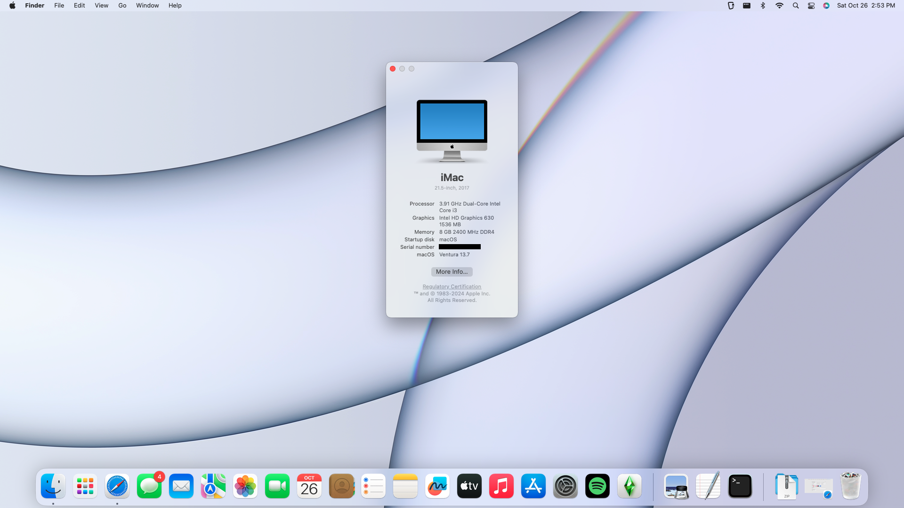

# ECS H110M4-C43 OpenCore Configuration

## System Information 

|  Part           |                                              |
|-----------------|----------------------------------------------|
|  Motherboard    |  ECS H110M4-C43, BIOS 2017/12/12             |
|  Chipset        |  H110                                        |
|  CPU            |  Intel Core i3-7100                          |
|  GPU            |  Intel HD Graphics 630                       |
|  Ethernet       |  Realtek 8111GN Gigabit Ethernet Controller  |
|  Wi-Fi          |  Intel Wireless-AC 7265                      |
|  Bluetooth      |  Intel Wireless-AC 7265 Bluetooth 4.2        |
|  Audio          |  Realtek ALC662                              |

## Tested macOS Version

|  macOS Version       |                      |
|----------------------|----------------------|
|  macos 13 Ventura    |  ✅ Working          |

## What's working:

* Graphics:            Yes
* Audio (line-out):    Yes
* Ethernet:            Yes
* Wi-Fi:               Yes
* Bluetooth:           Yes
* USB Ports:           Yes

## Not working / Tested:

* Sleep: Not working.
* HDMI Audio: Not tested.
* VGA: Not tested.
* DVI: Not tested.

## Notes:

* Generate your own iMac18,1 SMBIOS. Use the Dortania Guide.

* This EFI includes boot chime and GUI bootloader. Verbose boot is disabled.
  
## Updates:

  * Removed macOS Sequoia support.
